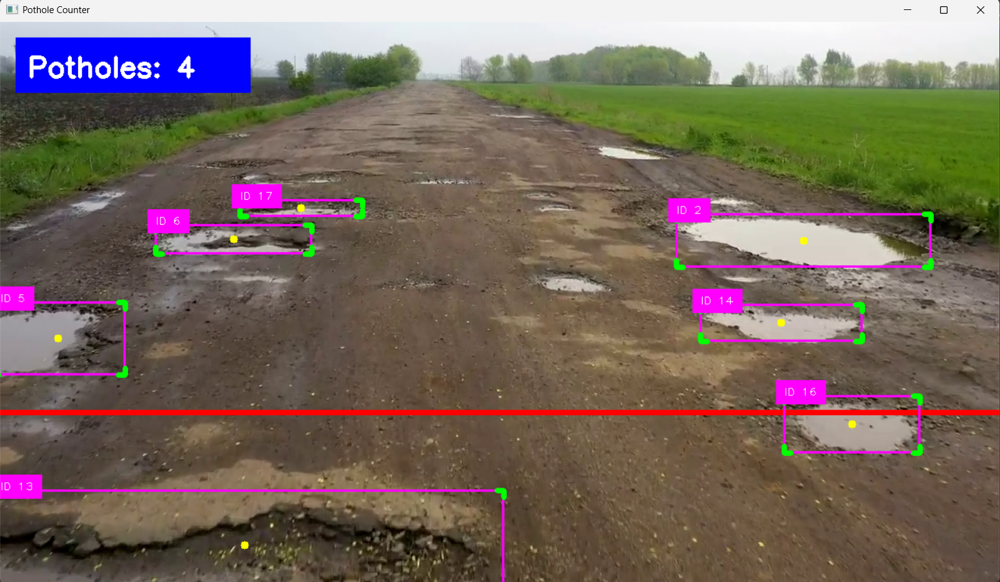

# Pothole Detection and Counting using YOLOv8

<p align="center">
  
</p>

## Introduction

This project detects and counts potholes from road videos using a custom-trained YOLOv8 model and the SORT tracking algorithm. Each pothole is assigned a unique ID, ensuring that the same pothole is counted only once while it remains visible in the video.

## Features

* Real-time pothole detection
* YOLOv8 custom-trained model
* SORT object tracking
* Unique ID assignment
* Automatic pothole counting
* False detection filtering
* Live visualization of detections and count

## Technologies Used

* Python
* OpenCV
* Ultralytics YOLOv8
* NumPy
* CvZone
* SORT Tracker

## Project Workflow

1. Read video frames using OpenCV.
2. Detect potholes using YOLOv8.
3. Filter low-confidence and very small detections.
4. Track potholes using SORT.
5. Assign a unique ID to each pothole.
6. Count potholes when they cross the virtual counting line.
7. Display the live count on screen.

## Installation

Install the required libraries:

```bash
pip install ultralytics opencv-python numpy cvzone scipy filterpy
```

## Usage

1. Place your video file inside the `Videos` folder.
2. Place the trained model inside the `yolo-weights` folder.
3. Run the script:

```bash
python pothole_counter.py
```

Press `Q` to stop the program.

## Output

The application displays:

* Bounding boxes around potholes
* Tracking IDs
* Counting line
* Total pothole count

Example:

```text
Potholes: 15
```

After processing:

```text
Final Count: 15
```

## Applications

* Smart road inspection
* Road maintenance monitoring
* Infrastructure assessment
* Smart city projects
* Automated pothole surveys

## Future Scope

* GPS tagging of potholes
* Pothole severity classification
* Real-time CCTV integration
* Cloud-based monitoring dashboard

## Author

Md.Ayan Akhtar Khan
